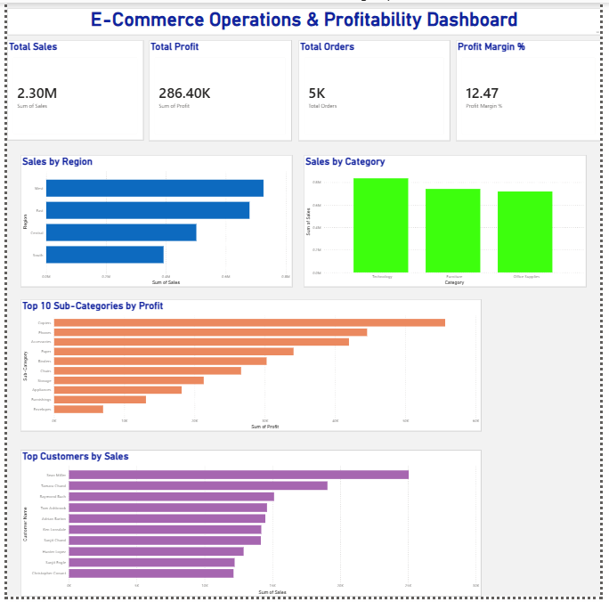

# E-Commerce Operations & Profitability Dashboard

## Project Overview

This project analyzes e-commerce sales performance, profitability, customer contribution, and regional business performance using SQL and Power BI.

An interactive dashboard was developed to monitor business KPIs and identify profitable growth opportunities.

## Dashboard Preview

## Tools Used

* SQL
* Power BI

## KPIs Created

* Total Sales
* Total Profit
* Total Orders
* Profit Margin %

## Business Questions Solved

* Which regions generate the highest revenue?
* Which categories contribute most to sales?
* Which sub-categories generate the highest profit?
* Who are the top customers by sales?
* How does profitability vary across regions?

## Skills Demonstrated

* SQL Querying
* KPI Development
* Dashboard Design
* Data Visualization
* Data Modeling
* Business Analysis

## Project Outcome

Built a business dashboard that helps stakeholders monitor performance and identify profitable business segments.

